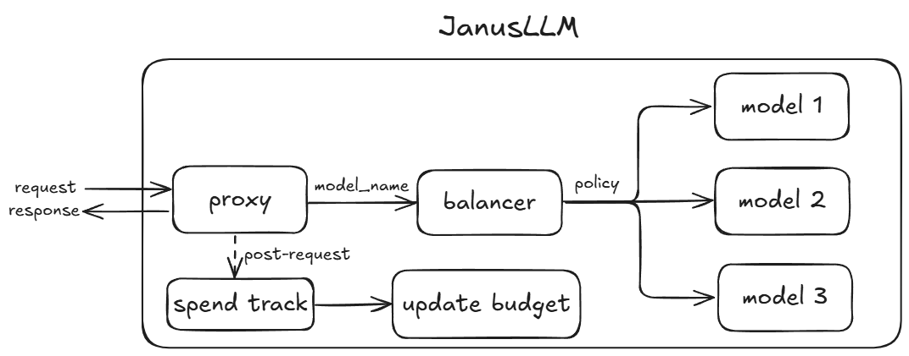

# JanusLLM

JanusLLM is an AI gateway designed to streamline interactions with multiple Large Language Model (LLM) APIs by providing a unified entry point.

## Features

JanusLLM offers a robust set of features to enhance the efficiency, scalability, and cost-effectiveness of LLM usage:

- Unified API Gateway 
- Advanced Load Balancing 
- Billing and Cost Management 
- Usage Limits and Quotas

## Architecture

