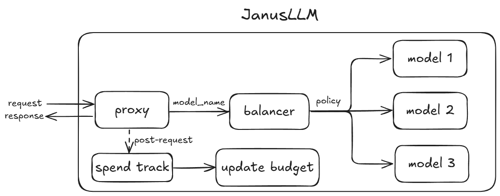

# JanusLLM

JanusLLM is an AI gateway designed to streamline interactions with multiple Large Language Model (LLM) APIs through one unified entry point.

## Features

- Unified gateway for OpenAI-compatible and Anthropic-compatible providers.
- Native proxy endpoints for chat completions, completions, embeddings, Anthropic messages, and model listing.
- Load balancing with round-robin, weighted, latency-based, and client-sticky policies.
- API key auth, model permissions, expiration checks, balance checks, and per-key RPM limiting.
- Token usage metering, spend logs, and key balance updates.
- PostgreSQL-backed organizations, teams, API keys, admin users, model metadata, and spend logs.
- Admin API and Swagger UI for local operations.

## Architecture



## Frontend Admin UI

The admin dashboard lives in `web/` and is built with Vite, React, and TypeScript. It currently uses mock dashboard data, with API client helpers prepared for `/v1/admin` resources and `/v1/models`.

```bash
cd web
npm install
npm run dev
```

By default, the Vite dev server proxies API calls to `http://localhost:8080`. Override it when needed:

```powershell
$env:VITE_JANUS_API_BASE_URL="http://localhost:8080"
npm run dev
```

On Unix-like shells, the one-line form also works:

```bash
VITE_JANUS_API_BASE_URL=http://localhost:8080 npm run dev
```

```text
Client
  |
  v
Gin Gateway
  |-- Auth middleware
  |-- Spend middleware
  |-- Proxy adapters
  |-- Balancer
  v
Provider endpoints

PostgreSQL stores auth, admin, model metadata, and billing records.
```

## Current Status

JanusLLM is currently an MVP gateway. Runtime routing is loaded from `config/config.yaml`; PostgreSQL is used for auth, admin, billing, and auxiliary model metadata.

This branch aligns docs with code and adds:

- startup synchronization from YAML model config into database model tables,
- graceful handling for old auth helpers that previously used `log.Fatal`,
- a modern admin frontend,
- an extensible balancer interface with latency-based and client-sticky strategies,
- richer spend log fields for provider, latency, cache hit, and tenant.

## Quickstart

1. Install prerequisites:

- Go 1.24.3 or newer
- PostgreSQL 14 or newer

2. Initialize the database:

```bash
psql -h <PG_HOST> -p <PG_PORT> -U <PG_USER> -d <DB_NAME> -f scripts/db/create_core_tables.sql
```

3. Configure the service:

```bash
cp config/config.yaml.example config/config.yaml
```

Fill in:

- `service.port`
- `secrets.database_url`
- `admin.master_key`
- `models.model_groups`

Environment variables override local secrets when present:

- `JANUS_DATABASE_URL`
- `JANUS_ADMIN_MASTER_KEY`

4. Run the gateway:

```bash
go mod tidy
go run ./cmd
```

5. Test a proxied request:

```bash
curl --location 'http://127.0.0.1:8080/v1/chat/completions' \
  --header 'Content-Type: application/json' \
  --header 'Authorization: Bearer <your_api_key>' \
  --data '{
    "model": "<model_group_name>",
    "messages": [{"role": "user", "content": "Hello"}],
    "stream": false,
    "temperature": 0.7,
    "max_tokens": 4096
  }'
```

## Admin API

On startup, JanusLLM creates or updates the built-in admin user `admin` using `admin.master_key` or `JANUS_ADMIN_MASTER_KEY`.

```bash
curl -u admin:<ADMIN_MASTER_KEY> http://127.0.0.1:8080/v1/admin/organizations
curl http://127.0.0.1:8080/swagger/openapi.json
```

Swagger UI is available at:

```text
http://127.0.0.1:8080/swagger/
```

## Configuration Priority

- `config/config.yaml` is the source of truth for runtime model routing.
- PostgreSQL model tables are an auxiliary management and audit view.
- Startup synchronization should upsert YAML model groups/endpoints into PostgreSQL and disable records that no longer exist in YAML.
- Upstream API keys should stay in config/secret storage; database rows should store secret references or empty values, not plaintext provider keys.
