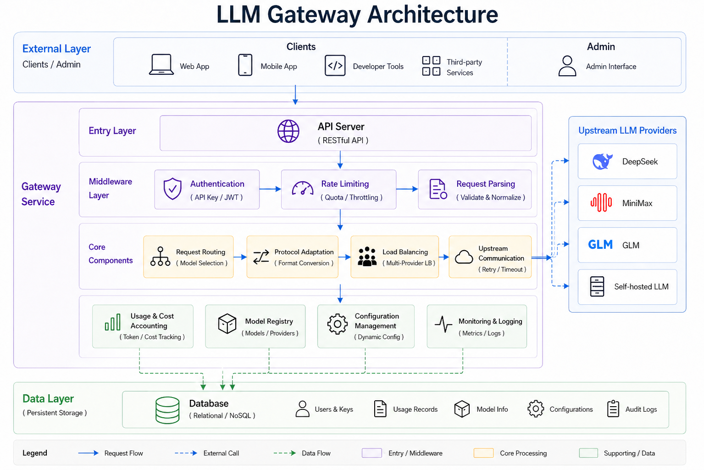

# JanusLLM

JanusLLM is an AI gateway designed to streamline interactions with multiple Large Language Model (LLM) APIs by providing a unified entry point.

## Architecture



### Features

JanusLLM offers a robust set of features to enhance the efficiency, scalability, and cost-effectiveness of LLM usage:

- Unified API Gateway for OpenAI/Anthropic LLM providers
- Advanced Load Balancing: Supports round-robin and weighted policies.
- Billing and Cost Management: Tracks token usage and spend by request/key/team/org/model, and updates key balance/total spend.
- Usage Limits and Quotas: Supports API key auth, model permission checks, key expiration, balance checks, and per-key RPM rate limiting.


## Quickstart

1. Prerequisites

- Go (>=1.24.3)
- PostgreSQL (14+ recommended)

2. Set Up PostgreSQL. Create a database and make sure the DB user has permission to create tables.

3. Initialize Database Schema
Run the schema script:

```bash
psql -h <PG_HOST> -p <PG_PORT> -U <PG_USER> -d janusllm-db -f scripts/db/create_core_tables.sql
```

4. Configure JanusLLM. Copy the example config `config/config.yaml.example` to `config/config.yaml` and fill in required fields, including: service info, database, admin key and upstream models.

5. Run JanusLLM and run a quick test

```bash
go mod tidy
go run cmd/main.go

curl --location 'http://127.0.0.1:8080/v1/chat/completions' \
--header 'Content-Type: application/json' \
--header 'Authorization: Bearer <your_api_key>' \
--data '{
    "max_tokens": 4096,
    "messages": [
        {
            "content": "Hello",
            "role": "user"
        }
    ],
    "model": "<model_name>",
    "stream": false,
    "temperature": 0.7
}'
```
